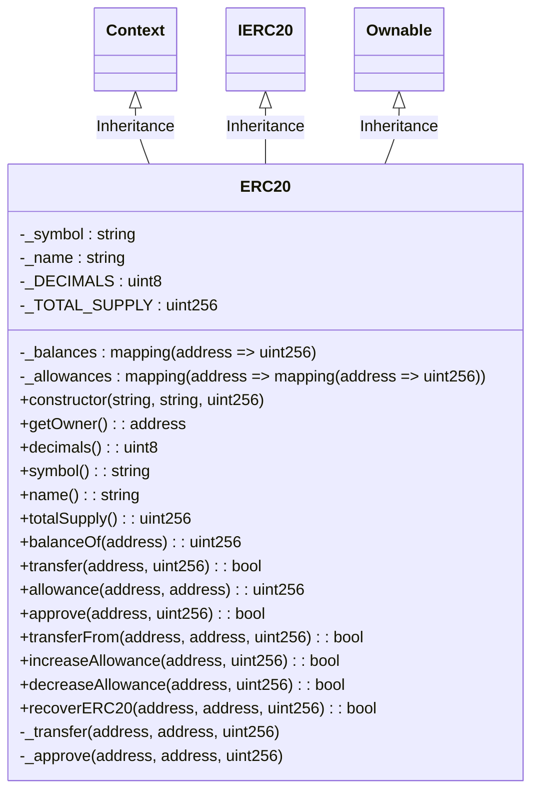

# Kenshi ERC20 Token Implementation

## Project Overview

This project provides the foundation for a fully functional ERC20 token
following the [Ethereum Improvement Proposal
20](https://eips.ethereum.org/EIPS/eip-20). The token includes features such as
transfer of tokens, approval for spending tokens on behalf of another address,
and retrieving the current token balance of any address.

In addition to the standard ERC20 functionality, the contract includes advanced
features such as allowance increases and decreases without the need to first
reset to zero, a design that potentially mitigates a common race condition in
ERC20 contracts.

The codebase is fully tested, with 100% coverage ensuring robustness and
reliability of the token contract.

The project uses a suite of development tools for testing, linting, and
formatting, ensuring the code's quality and readability. It also includes a
deployment script for deploying the token contract to any Ethereum-based
network.

The project is structured for ease of navigation, with a clear separation of
tests, contracts, and deployment scripts. The contracts directory contains the
main token contract.

## Functional Requirements

### Roles

- **Owner:** The owner of the contract who has the authority to recover ERC20
  tokens sent to the contract by mistake.
- **User:** A user of the token who can perform standard ERC20 operations.

### Features

- Create a new ERC20 token with a specified name, symbol, and total supply.
- Transfer tokens from one address to another.
- Approve a certain amount of tokens to be spent by another address.
- Retrieve the balance of tokens held by an address.
- Retrieve the total supply of tokens.
- Increase or decrease the allowance of tokens that an address can spend on
  behalf of the token owner.
- Recover ERC20 tokens sent to the contract by mistake (only by the owner).

### Use Cases

- A user creates a new ERC20 token for use within a specific ecosystem or
  application.
- A user transfers tokens to another address as part of a transaction within an
  application.
- A user approves a certain amount of tokens to be spent by a decentralized
  application (dApp).
- A user checks the balance of their tokens to keep track of their holdings.
- A user increases the allowance of tokens a dApp can spend on their behalf
  without needing to approve each transaction.
- A user decreases the allowance of tokens a dApp can spend on their behalf if
  they decide to stop using the dApp.
- The owner recovers ERC20 tokens that were mistakenly sent to the contract,
  preventing the tokens from being permanently locked.

## Technical Requirements

### Libraries and Tools

- **Hardhat:** A development environment to compile, deploy, test, and debug
  Ethereum software.
- **Ethers.js:** A library for interacting with the Ethereum blockchain and its
  ecosystem.
- **Waffle:** A library for writing and testing smart contracts.
- **OpenZeppelin Contracts:** A library for secure smart contract development.
- **Solidity:** The programming language used for implementing smart contracts
  on Ethereum.
- **Prettier:** An opinionated code formatter.
- **Solhint:** A linter to identify and fix style and security issues in
  Solidity code.

### Project Structure

The repository follows a standard Hardhat project structure. Below is a tree
structure of the repository:

```
.
├── README.md
├── artifacts
│   ├── @openzeppelin
│   ├── build-info
│   └── contracts
├── contracts
│   └── ERC20.sol
├── coverage.json
├── docs
│   ├── ERC20.md
│   ├── elin
│   ├── requirements.md
│   └── usage.md
├── hardhat.config.js
├── package-lock.json
├── package.json
├── requirements.txt
├── scripts
│   └── deploy.js
└── test
    └── KNS.js
```

- The `contracts` directory contains the ERC20 Solidity smart contract.
- The `test` directory contains the test files.
- The `scripts` directory contains scripts for tasks like deployment.
- The `.env.example` file is used to set environment variables like the private
  key and RPC addresses.
- The `.solhint.json` and `.prettierrc` files are configuration files for
  Solhint and Prettier, respectively.
- The `hardhat.config.js` file is the configuration file for Hardhat.
- The `package.json` file contains the project metadata and dependencies.

Refer to the Kenshi ERC20 token [README](../README.md) file for more info.

### Class Diagram

The following class diagram shows the public and private properties of the ERC20
token contract and its class inheritance:



### Functions

The following chart shows how the ERC20 token contract functions are used internally:


### Usage and Roles

The following sequence diagram shows how different roles can interact with the contract:


## Contract Information

### Flow

This contract provides a basic implementation of the ERC20 token protocol with
additional features for recovering tokens sent to the contract address by
mistake.

A typical usage flow would be:

1. **Contract Creation** - The contract is created with the `constructor`
   function. It sets the initial state of the contract, including name, symbol,
   and total supply of the tokens. The total supply of tokens is assigned to the
   contract creator.

2. **Token Transfer** - A user can transfer tokens to another user's address
   using the `transfer` function. The `_transfer` internal function is called,
   which checks the sender's balance, subtracts the transfer amount, and adds it
   to the recipient's balance.

3. **Allowance Setting** - A user can set an allowance for another user's
   address using the `approve` function. This sets how many tokens the approved
   address can spend on behalf of the caller.

4. **Token Transfer from Another Address** - A user can transfer tokens from an
   approved address using the `transferFrom` function. This function checks the
   allowance set for the caller, then calls the `_transfer` internal function to
   move the tokens.

5. **Token Recovery** - In case tokens are sent to the contract address by
   mistake, the owner of the contract can recover them using the `recoverERC20`
   function.

### Storage

The contract has several private and public variables:

- `_balances`: A mapping that keeps track of the number of tokens held by each
  address.
- `_allowances`: A mapping of mapping that stores the allowances set by token
  holders for other addresses.
- `_name`, `_symbol`, `_DECIMALS`, and `_TOTAL_SUPPLY`: These variables store
  the name, symbol, decimals, and total supply of the token, respectively.

### Events

The contract emits two types of events:

- `Transfer`: This event is emitted whenever tokens are transferred between
  addresses.
- `Approval`: This event is emitted whenever an allowance is set or modified.

### Functions

The contract has several functions that provide the functionalities of the ERC20
token and some additional features:

- `constructor`: Sets the initial state of the contract.
- `getOwner`, `decimals`, `symbol`, `name`, `totalSupply`, and `balanceOf`:
  These are view functions that return the respective variable values.
- `transfer`: Transfers tokens from the caller's address to another address.
- `approve`: Sets an allowance for another address.
- `transferFrom`: Transfers tokens from an approved address to another address.
- `increaseAllowance` and `decreaseAllowance`: These functions increase and
  decrease an allowance set for an address, respectively.
- `_transfer` and `_approve`: These are internal functions that are used by
  other functions to transfer tokens and set allowances.
- `recoverERC20`: Transfers tokens sent to the contract address to another
  address.
